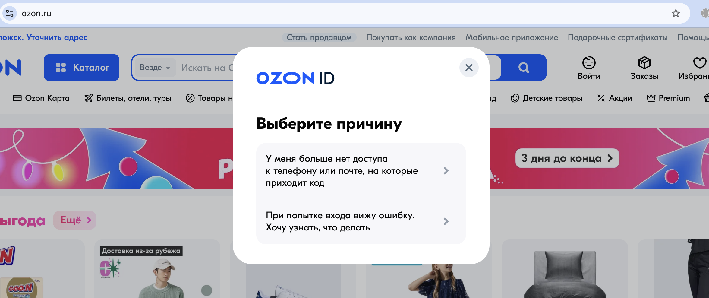
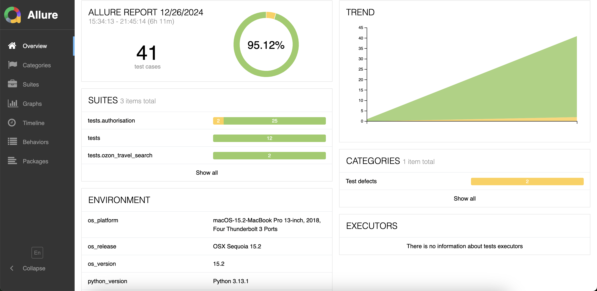

# Ozon и Ozon Travel
## Оглавление
1. [Описание проекта](#описание-проекта)
1. [Затронутые в проекте виды тестирования](#затронутые-в-проекте-виды-тестирования)
1. [Действия с веб-приложением](#действия-с-веб-приложением)
1. [Демо реализации автотестов на Youtube](#демо-реализации-автотестов-на-youtube)
1. [Воспроизведение тестов](#воспроизведение-тестов)
1. [Тестовые наборы Ozon и Ozon Travel](#тестовые-наборы-ozon-и-ozon-travel)  
    1. [Тестовый набор «tests» Ozon](#1-тестовый-набор-tests-httpswwwozonru)         
        1. [Smoke тест — проверка функции покупки товара](#1-smoke-тест--проверка-функции-покупки-товара)
        1. [Тестирование смены цвета иконки «список заказов» при наведении курсора](#2-тестирование-смены-цвета-иконки-список-заказов-при-наведении-курсора)
        1. [Проверка функции подсчёта общей стоимости заказа c Ozon Картой в корзине](#3-проверка-функции-подсчёта-общей-стоимости-заказа-c-ozon-картой-в-корзине)
        1. [Проверка всплывающих уведомлений](#4-проверка-всплывающих-уведомлений)
        1. [Тестирование выпадающего списка элементов кнопки личного кабинета](#5-тестирование-выпадающего-списка-элементов-кнопки-личного-кабинета)
        1. [Тестирование работы cookies](#6-тестирование-работы-cookies)
        1. [Получение атрибутов страницы](#7-получение-атрибутов-страницы)
        1. [Тестирование производительности](#8-тестирование-производительности)
        1. [Тестирование производительности при запущенном расширении](#9-тестирование-производительности-при-запущенном-расширении)
        1. [Тестирование доступности](#10-тестирование-доступности)
        1. [Тестирование локализации](#11-тестирование-локализации)
        1. [Тест-сессия на основе тест-тура «сомневающийся покупатель»](#12-тест-сессия-на-основе-тест-тура-сомневающийся-покупатель)
    1. [Тестовый набор «tests.authorisation» Ozon](#2-тестовый-набор-testsauthorisation-httpswwwozonru)
        1. [Модальное окно «Авторизация»](#13-модальное-окно-авторизация)
            1. [Тестирование поля ввода номера телефона](#131-тестирование-поля-ввода-номера-телефона)
                1. [Чек-лист проверок](#чек-лист-проверок-131)
                1. [Тест-кейсы](#1311-ввести-валидный-номер-телефона-9999999999)
            1. [Тестирование выпадающего списка кодов стран](#132-тестирование-выпадающего-списка-кодов-стран)
            1. [Тестирование входа через Госуслуги](#133-тестирование-входа-через-госуслуги)
            1. [Тестирование кнопки «Не могу войти»](#134-тестирование-кнопки-не-могу-войти)
            1. [Тестирование кнопки закрытия окна «X»](#135-тестирование-кнопки-закрытия-окна-x)
            1. [Тестирование окна «Войдите по почте»](#136-тестирование-окна-войдите-по-почте)
                1. [Тестирование кнопки «Вернуться на главный экран»](#1361-тестирование-кнопки-вернуться-на-главный-экран)
                1. [Тестирование кнопки «Не могу войти»](#1362-тестирование-кнопки-не-могу-войти)
                1. [Тестирование кнопки закрытия окна «X»](#1363-тестирование-кнопки-закрытия-окна-x)
                1. [Тестирование поля ввода почты](#1364-тестирование-поля-ввода-почты)
                    1. [Чек-лист проверок](#чек-лист-проверок-1364)
                    1. [Тест-кейсы](#13641-тестирование-кнопки-очистки-поля-ввода-почты-х)
    1. [Тестовый набор «tests.ozon_travel_search» Ozon Travel](#3-тестовый-набор-testsozon_travel_search-httpswwwozonrutravel)
        1. [Smoke-тест функции поиска билетов](#14-smoke-тест-функции-поиска-билетов)
            1. [Позитивный тест](#141-позитивный-тест)
            1. [Негативный тест](#142-негативный-тест)
1. [Баг-репорт](#баг-репорт)
1. [План тестирования исправления багов](#план-тестирования-исправления-багов)
1. [Отчет о проведенном тестировании](#отчет-о-проведенном-тестировании)

## Описание проекта

Этот проект представляет собой рабочие образцы 54 автоматизированных тестов с применением ООП в браузере Google Chrome из тестовых наборов, таблиц состояний/переходов, матриц трассировки и тест-сессий сайтов www.ozon.ru  и www.ozon.ru/travel. 

Оформление проекта ориентировано на Page Object Model (POM). В проекте используются Python, JavaScrypt, Selenium Webdriver, time, os, pickle, requests. Для инспектирования «труднодоступных» элементов использовался дебаггер JS кода.

В проекте представлено общее понимание применения основных аспектов теории тестирования веб-приложений (классы эквивалентности, граничные значения, таблицы состояний/переходов, тест-туры, попарное тестирование, матрица трассировки, тестирование исправления багов), а также необходимый уровень знания языка программирования Python с интеграцией JavaScrypt скриптов и фреймворка Selenium для возможной реализации большинства случаев автоматизированного тестового покрытия.

Утвержденной спецификацией и по умолчанию верифицированными считаются текущие реализованные пользовательские интерфейсы сайтов www.ozon.ru  и www.ozon.ru/travel.

Комментарии в коде проекта не разъясняют сам код и не являются учебно-ориентированными.

Ожидаемые результаты по каждому из шагов тест-кейсов объединены в общий ожидаемый результат по заголовкам каждого тест-кейса.

Общее время выполнения всех 54 автотестов с отчетом: 9 мин 10 сек.

## Затронутые в проекте виды тестирования

1. По объекту тестирования.
2. Функциональное тестирование.
3. Smoke.
4. Регрессы.
5. Исследовательское.
6. Тестирование производительности.
7. Юзабилити UI тестирование.
8. Тестирование безопасности.
9. Тестирование локализации.
10. Тестирование доступности.
11. Тестирование совместимости.
12. Тестирование кэширования.

## Действия с веб-приложением

В проекте реализована автоматизация большинства всех возможных действий с сайтом, которые пользователь может совершать через доступные видимые элементы:

- Скролл на странице
- Обновление страницы
- Перемещение по шагам по истории браузера.
- Обновление страницы.
- Работа с несколькими вкладками и переключения между ними.
- Работа с полями ввода.
- Работа с клавиатурой.
- Работа с чек-боксами.
- Работа с radiobutton.
- Наведение курсора на элементы.
- Работа с выпадающими списками.
- Работа с расширениями браузера.
- Работа с куками.
- Получение необходимых данных со страницы (url, html код, title, class, id, значение атрибутов).
- Работа с вложенными html-страницами.

## Демо реализации автотестов на Youtube

Ссылка на плей-лист с 6 демонстрационными примерами:
https://www.youtube.com/playlist?list=PL_MUMhbrEE--54W-B4TaaeVRv7Zy8scmH

В плей-листе представлены 6 видео:

1. [Тест-кейс 6](#6-тестирование-работы-cookies) — Тестирование работы cookies на Ozon.
2. [Тест-кейс 12](#12-тест-сессия-на-основе-тест-тура-сомневающийся-покупатель) — Тест-сессия на основе тест-тура «сомневающийся покупатель» на Ozon.
3. [Тест-кейс 13.4](#134-тестирование-кнопки-не-могу-войти) — Тестирование кнопки «Не могу войти» (найден баг) на Ozon.
4. [Тест-кейсы 13.6.4.9 - 13.6.4.18](#13649-ввести-валидный-емейл-незарегистрированного-пользователя-с-пробелом-внутри-w-wwww) — Тестирование поля ввода почты на Ozon.
5. [Тест-кейс 14.1](#141-позитивный-тест) — Smoke-тест функции поиска билетов на Ozon Travel.
6. [Отчет о проведенном тестировании](#отчет-о-проведенном-тестировании).

## Воспроизведение тестов

Локальное воспроизведение:

1. Браузер Google Chrome.
2. Любая среда разработки для запуска кода Python.
3. Виртуальное окружение Python venv.
4. Selenium.
5. Webdriver_manager.
6. Requests.
7. Allure.

Причины прерывания:

1. Неустойчивое интернет соединение. В результате будет ошибка: NoSuchElementException. В этом случае расставленные тайм-слипы рекомендую увеличивать, чтобы страницы успевали прогружаться.
2. Сайты www.ozon.ru  и www.ozon.ru/travel являются часто обновляемым, а это значит, что индексация тех или иных элементов может быть изменена разработчиками в любой момент. В результате будет ошибка: NoSuchElementException. В логах отчета об ошибке вы всегда сможете увидеть какой именно элемент не индексируется. Сверить локатор и заменить на актуальный можно в директории Locators в файле locators.py.
3. Для корректного исполнения 9 теста необходимо скачать в директорию проекта в Path/Tests/extensions любое доступное расширение для браузера Google Chrome в формате .crx (например AdBlock.crx). При отсутствии расширения .crx тест будет прерываться с ошибкой OSError: Path to the extension doesn't exist.

## Тестовые наборы Ozon и Ozon Travel

Предусловие для всех тестовых наборов: пользователь не авторизован.

Содержание тестовых наборов:

1. «tests» (тесты с 1 по 12) — 12 тест-кейсов для различных тестовых случаев.
2. «tests.authorisation» (тесты п. 13) — чек-листы и тест-кейсы для тестирования модального окна авторизации Ozon.
3. «tests.ozon_travel_search» (тесты п. 14) — тест-кейсы для тестирования функции бронирования билетов Ozon Travel.

### 1 Тестовый набор «tests» (https://www.ozon.ru/)

#### 1. Smoke тест — проверка функции покупки товара 

Цель: Купить любой товар в любом количестве с главной страницы.

Ожидаемый результат: товар успешно добавится в корзину, но при попытке перейти к оформлению покупки пользователь попадет на страницу авторизации.

Шаги воспроизведения:
1. Зайти на www.ozon.ru
2. Скроллить вниз до категории «Товары нарасхват».
3. Кликнуть на первый товар. 
4. На странице деталировки товара кликнуть на кнопку «Купить в один клик». Происходит переход на страницу авторизации в текущем окне.
5. Убедиться, что переход на страницу авторизации произошел.

#### 2. Тестирование смены цвета иконки «список заказов» при наведении курсора 

Цель: протестировать изменение цвета иконки «список заказов» в шапке после наведения на нее мышки.

Ожидаемый результат: при наведении на иконку «список заказов» цвет должен измениться.

Шаги воспроизведения:
1. Зайти на www.ozon.ru
2. Навести курсор мышки на иконку «список заказов» в шапке.
3. Убедиться, что цвет иконки изменился.

#### 3. Проверка функции подсчёта общей стоимости заказа c Ozon Картой в корзине  

Цель: протестировать корректный подсчет итоговой суммы заказа c Ozon Картой в корзине.

Критерии входа: добавить 2 товара в корзину с главной страницы сайта в количестве более 1 единицы каждый.

Ожидаемый результат: Сумма общей цены с Ozon Картой за все единицы товара 1 с общей ценой с Ozon Картой за все единицы товара 2 должна быть равна итоговой сумме в корзине с Ozon Картой. 

Шаги воспроизведения:
1. Зайти на www.ozon.ru.
2. Скроллить вниз до категории «Товары нарасхват».
3. Кликнуть на первый товар. Страница товара откроется в новой вкладке.
4. Кликнуть на второй товар. Страница товара откроется в новой вкладке.
5. На странице первого товара кликнуть на кнопку «Добавить в корзину» в предложенном количестве больше 1 единицы и дождаться появления кнопки «В корзине перейти».
6. На странице второго товара кликнуть на кнопку «Добавить в корзину» в предложенном количестве больше 1 единицы и дождаться появления кнопки «В корзине перейти».
7. Кликнуть на кнопку «В корзине перейти». Происходит переход на страницу корзины в текущем окне.
8. Сравнить сумму общей цены с Ozon Картой за все единицы товара 1 с общей ценой с Ozon Картой за все единицы товара 2 с итоговой суммой в корзине с Ozon Картой. 
9. Убедиться, что суммы равны.

#### 4. Проверка всплывающих уведомлений 

Цель: протестировать корректность появления/отключения на главной странице уведомления о куках в нижней правой части окна.

Ожидаемый результат: уведомление о Куках появилось и после клика на кнопку «ОК» скрылось. 

Шаги воспроизведения:
1. Зайти на www.ozon.ru.
2. Дождаться появления уведомления о куках в нижней правой части окна.
3. Кликнуть на кнопку «Ок» в уведомлении о куках.
4. Убедиться, что уведомление скрылось.

#### 5. Тестирование выпадающего списка элементов кнопки личного кабинета

Цель: проверить работу выпадающего списка кнопки личного кабинета в виде «лица» и активности всех элементов кнопок в выпадающем списке/меню. 

Ожидаемый результат: при наведении на «лицо» должен выпадать список кнопок: «Войти или зарегистрироваться» и «Личный кабинет». При клике на «Войти или зарегистрироваться» появляется модальное неблокирующее окно регистрации на текущей странице. При клике на «Личный кабинет» открывается страница личного кабинета.

Шаги воспроизведения:
1. Зайти на www.ozon.ru.
2. Кликнуть на «Ок» в уведомлении о куках.
3. Навести мышкой на иконку «лицо» в шапке справа.
4. Убедиться, что выпадает список с кнопками: «Войти или зарегистрироваться» и «Личный кабинет».

#### 6. Тестирование работы cookies 

Цель: проверить работу куков при добавлении 2 товаров в корзину путем очистки и восстановления истории куков.

Ожидаемый результат: после добавления двух разных наименований товаров в корзину и очистки куков товары пропадут из корзины, а после восстановления удаленных куков эти же товары в том же количестве вернутся в корзину.

Шаги воспроизведения:
1. Зайти на www.ozon.ru.
2. Скроллить вниз до категории «Товары нарасхват».
3. Кликнуть на первый товар. Страница товара откроется в новой вкладке.
4. Кликнуть на второй товар. Страница товара откроется в новой вкладке.
5. На странице первого товара кликнуть на кнопку «Добавить в корзину» в предложенном количестве больше 1 единицы и дождаться появления кнопки «В корзине перейти».
6. На странице второго товара кликнуть на кнопку «Добавить в корзину» в предложенном количестве больше 1 единицы и дождаться появления кнопки «В корзине перейти».
7. Кликнуть на кнопку «В корзине перейти». Происходит переход на страницу корзины в текущем окне.
8. Скачать все куки со страницы корзины.
9. Удалить все куки со страницы корзины.
10. Перезагрузить страницу корзины.
11. Убедиться, что куки удалены.
12. Восстановить все куки на странице корзины.
13. Перезагрузить страницу корзины.
14. Убедиться, что куки восстановлены и те же 2 позиции товаров снова находятся в корзине.

Демо реализация на Youtube: https://youtu.be/rJh4BuF2QLo

#### 7. Получение атрибутов страницы 

Цель: Получить атрибуты для идентификации текущей страницы www.ozon.ru (url, title) и скачать html-код прогруженной части страницы www.ozon.ru в отдельный файл.

Ожидаемый результат: текущая страница открылась и в отдельную директорию сохранился файл с html-кодом текущей страницы.

Шаги воспроизведения:
1. Зайти на www.ozon.ru.
2. Сверить корректность url текущей страницы.
3. Сверить корректность title текущей страницы.
4. Сохранить в отдельную директорию файл с html-кодом текущей страницы.
5. Убедиться, что файл скачан.

#### 8. Тестирование производительности 

Цель: Измерить время, прошедшее между отправкой первого байта запроса на страницу www.ozon.ru и завершением разбора заголовков headers.

Ожидаемый результат: получен промежуток времени в виде разницы, прошедший между отправкой запроса и получением ответа.

Шаги воспроизведения:
1. Зайти на www.ozon.ru.
2. Убедиться, что получен промежуток времени в виде разницы, прошедший между отправкой запроса и получением ответа.

#### 9. Тестирование производительности при запущенном расширении 

Цель: При запущенном расширении измерить время, прошедшее между отправкой первого байта запроса на страницу сайта www.ozon.ru и завершением разбора заголовков headers.

Ожидаемый результат: получен промежуток времени в виде разницы, прошедший между отправкой запроса и получением ответа в режиме работы браузера со включенным расширением.

Шаги воспроизведения:
1. Установить любое расширение в браузер.
2. Запустить расширение.
3. Зайти на www.ozon.ru.
4. Получить промежуток времени в виде разницы, прошедший между отправкой запроса и получением ответа.

#### 10. Тестирование доступности 

Цель: Убедиться, что клик на кнопку «Для слабовидящих» в подвале переводит на страницу для слабовидящих. 

Ожидаемый результат: после клика на на кнопку «Для слабовидящих» происходит переход на страницу для слабовидящих.

Шаги воспроизведения:
1. Зайти на www.ozon.ru.
2. Отключить pop-up уведомления о геолокации и куках.
3. Скроллить в самый низ страницы.
4. Справа в подвале кликнуть на кнопку «Для слабовидящих».
5. Убедиться, что страница для слабовидящих открылась.

#### 11. Тестирование локализации 

Цель: Убедиться, что клик на кнопку для смены валюты «RUB» в шапке открывает модальное неблокирующее окно с выпадающим списком выбора валют и выбор валюты «Доллар США» меняет валюту www.ozon.ru на USD. 

Ожидаемый результат: после клика на кнопку «RUB» открывается окно с выбором валют, и после выбора «Доллар США» валюта изменяется.

Шаги воспроизведения:
1. Зайти на www.ozon.ru.
2. Кликнуть на «RUB» в шапке.
3. В появившемся модальном окне с выпадающим списком валют выбрать «Доллар США USD».
4. Убедиться, что смена валюты произошла.

#### 12. Тест-сессия на основе тест-тура «сомневающийся покупатель»

Описание тура: Тест-тур принят с учетом специфики сайта и возможного поведения большинства пользователей. Пользователь не просто один раз выбирает нужные фильтры, добавляет заказ в корзину и переходит к оформлению, а меняет фильтры, отменяем, То есть одновременно и пытаемся поломать ПО, и охватываем разный функционал сразу.

Цель: Добавить в корзину товар 1 наименования оригинальный робот-пылесос с контейнером или аквафильтром бренда Xiaomi в средней ценовой категории после перебора разных доступных фильтров.

Ожидаемый результат: товар успешно добавится в корзину и при попытке перейти к оформлению покупки будет произведен переход на страницу авторизации.

Шаги воспроизведения:
1. Зайти на www.ozon.ru
2. В поисковую строку в верхней части сайта ввести запрос «пылесос» и нажать на клавиатуре клавишу «enter». Происходит переход на страницу каталога товаров по результату поиска «пылесос». Слева находятся основные фильтры.
3. В фильтре «Категория» выбрать категорию «Роботы-пылесосы». Фильтр применяется сразу.
4. В предложенном списке выбрать первый товар и кликнуть на его картинку. Страница деталировки товара откроется в новой вкладке.
5. Кликнуть на кнопку «Перейти к описанию» справа от картинки.
6. Кликнуть на кнопку «В корзину». Дождаться появления кнопки «В корзине перейти».
7. Кликнуть на кнопку «В корзине перейти». Страница корзины откроется в текущем окне.
8. На странице корзины кликнуть «Удалить выбранные». Откроется окно подтверждения.
9. Кликнуть «Удалить» в окне подтверждения.
10. Убедиться, что корзина пустая.
11. Вернуться на один шаг назад в истории браузера.
12. Закрыть текущую вкладку.
13. В оставшейся вкладке скроллить вниз до фильтра «Сроки доставки».
14. В фильтре «Сроки доставки» выбрать Radiobutton «До 3 дней». Фильтр применяется сразу. 
15. Убедиться, что фильтр применился.
16. Скроллить вниз до фильтра «Бренд» и выбрать бренд «Xiaomi». Фильтр применяется сразу. 
17. Скроллить вниз до фильтра «Цена».
18. В фильтре «Цена» «от» выставить значение 30000. 
19. В фильтре «Цена» «до» выставить 60000 и нажать на клавиатуре «enter». Фильтр применяется сразу. 
20. Скроллить вниз до фильтра «Оригинальный товар».
21. Включить switch «Оригинальный товар». Фильтр применяется сразу. 
22. Скроллить вниз до фильтра «Вид пылесборника».
23. Выбрать чек-бокс «Контейнер». Фильтр применяется сразу. 
24. Плюсом к «Контейнер» выбрать чек-бокс «Аквафильтр». Фильтр применяется сразу. 
25. Скроллить вверх в начало каталога до фильтра сортировки. По умолчанию фильтр установлен на «Популярные». 
26. Скроллить вверх в начало каталога.
27. В фильтре сортировки изменить значение с «Популярные» на «С высоким рейтингом». 
28. Проверить под выпадающим списком «сортировки» наличие всех 7 фильтров: «Сроки доставки: До 7 дней», «Бренд: Xiaomi», «Цена: от 30 000 до 60 000», «Оригинальный товар», «Вид пылесборника: Контейнер», «Вид пылесборника: Аквафильтр».
29. Кликнуть на картинку самого первого товара. Страница деталировки товара откроется в новой вкладке.
30. На странице деталировки кликнуть на кнопку «В корзину». Дождаться появления кнопки «В корзине перейти».
31. Кликнуть на кнопку «В корзине перейти». Страница корзины откроется в текущем окне.
32. На странице корзины кликнуть на кнопку «Перейти к оформлению». Откроется страница авторизации в текущем окне.
33. Убедиться, что переход на страницу авторизации произошел.

Демо реализация на Youtube: https://youtu.be/88Vp-eqVzlg

### 2 Тестовый набор «tests.authorisation» (https://www.ozon.ru/)

#### 13. Модальное окно «Авторизация»

Переход на pop-up окно «Авторизация» осуществляется после клика на иконку «лицо» в правой части шапки сайта www.ozon.ru. Переход также осуществляется после наведения мышки на иконку и клика на кнопку «Войти или зарегистрироваться» в выпадающем списке.

##### 13.1 Тестирование поля ввода номера телефона 

План тестирования: проверить на валидность введенных данных поле ввода телефона, которое игнорирует латинские/кириллистические буквы, все возможные символы и принимает только цифры.

Валидными считаются только числовые значения длиною в 10 символов, имеющие формат действующих номеров телефонов.

##### Чек-лист проверок 13.1:
1. Ввести валидный номер телефона «9999999999».
2. Ввести 11 чисел «99999999999».
3. Ввести 9 чисел «999999999».
4. Ввести одно число «1».
5. Оставить пустое поле.
6. Ввести невалидный номер телефона «1111111111».
7. Принимает ли поле латинские буквы, ввести «w».
8. Принимает ли поле кириллические буквы, ввести «ж».
9. Принимает ли поле значения с плавающей запятой, ввести «9,999999999».
10. Принимает ли поле значения с плавающей точкой, ввести «9.999999999».
11. Принимает ли поле числовые значения со специальными символами < > * ! @ # $ % &  /.
12. Принимает ли поле пробелы.
13. Принимает ли поле отрицательные значения, ввести «-9999999999.».
14. Принимает ли поле положительные значения, ввести «+9999999999.».

##### 13.1.1 Ввести валидный номер телефона «9999999999» 

Цель: проверка пункта 1 чек-листа 13.1.

Ожидаемый результат: поле отображает вводимые цифры и после клика на кнопку «Войти» открывается окно ожидания отправленного смс кода.

Шаги воспроизведения:
1. Открыть окно «Авторизация» сайта www.ozon.ru.
2. В поле ввода номера телефона ввести: 9999999999.
3. Убедиться, что введены валидные символы.
4. Кликнуть «Войти».
5. Убедиться, что открылось окно ожидания введения отправленного смс-кода.

##### 13.1.2 Ввести 11 чисел «99999999999» 

Цель: проверка пункта 2 чек-листа 13.1.

Ожидаемый результат: поле отображает только первые 10 цифр, после клика на кнопку «Войти» открывается окно ожидания отправленного смс кода.

Шаги воспроизведения:
1. Открыть окно «Авторизация» сайта www.ozon.ru.
2. В поле ввода номера телефона ввести : 99999999999.
3. Убедиться, что введены валидные символы.
4. Кликнуть «Войти».
5. Убедиться, что открылось окно ожидания введения отправленного смс-кода.

##### 13.1.3 Ввести 9 чисел «999999999» 

Цель: проверка пункта 3 чек-листа 13.1.

Ожидаемый результат: поле отображает вводимые символы, после клика на кнопку «Войти» появляется ошибка «Некорректный формат телефона» и окно ожидания отправленного смс кода не открывается. 

Шаги воспроизведения:
1. Открыть окно «Авторизация» сайта www.ozon.ru.
2. В поле ввода номера телефона ввести : 999999999.
3. Убедиться, что введены валидные символы.
4. Кликнуть «Войти».
5. Убедиться, что появилась ошибка «Некорректный формат телефона».
6. Убедиться, что окно ожидания отправленного смс-кода не открылось.

##### 13.1.4 Ввести одно число «1» 

Цель: проверка пункта 4 чек-листа 13.1.

Ожидаемый результат: поле отображает вводимую цифру, после клика на кнопку «Войти» появляется ошибка «Некорректный формат телефона» и окно ожидания отправленного смс кода не открывается. 

Шаги воспроизведения:
1. Открыть окно «Авторизация» сайта www.ozon.ru.
2. В поле ввода номера телефона ввести: 1.
3. Убедиться, что введен валидный символ.
4. Кликнуть «Войти».
5. Убедиться, что появилась ошибка «Некорректный формат телефона».
6. Убедиться, что окно ожидания отправленного смс-кода не открылось.

##### 13.1.5 Оставить поле пустым 

Цель: проверка пункта 5 чек-листа 13.1.

Ожидаемый результат: после клика на кнопку «Войти» появляется ошибка «Некорректный формат телефона» и окно ожидания отправленного смс кода не открывается. 

Шаги воспроизведения:
1. Открыть окно «Авторизация» сайта www.ozon.ru.
2. Поле ввода номера телефона оставить пустым.
3. Убедиться, что поле пустое.
4. Кликнуть «Войти».
5. Убедиться, что появилась ошибка «Некорректный формат телефона».
6. Убедиться, что окно ожидания отправленного смс-кода не открылось.

##### 13.1.6 Ввести невалидный номер телефона «1111111111» 

Цель: проверка пункта 6 чек-листа 13.1.

Ожидаемый результат: поле отображает вводимые символы, после клика на кнопку «Войти» появляется ошибка «Некорректный формат телефона» и окно ожидания отправленного смс кода не открывается. 

Шаги воспроизведения:
1. Открыть окно «Авторизация» сайта www.ozon.ru.
2. В поле ввода номера телефона ввести: 1111111111.
3. Убедиться, что введены валидные символы.
4. Кликнуть «Войти».
5. Убедиться, что появилась ошибка «Некорректный формат телефона».
6. Убедиться, что окно ожидания отправленного смс-кода не открылось.

##### 13.1.7 Ввести латинскую букву «w» 

Цель: проверка пункта 7 чек-листа 13.1.

Ожидаемый результат: поле ввода не отображает вводимый символ, после клика на кнопку «Войти» появляется ошибка «Некорректный формат телефона» и окно ожидания отправленного смс кода не открывается. 

Шаги воспроизведения:
1. Открыть окно «Авторизация» сайта www.ozon.ru.
2. В поле ввода номера телефона ввести: w.
3. Убедиться, что поле ввода осталось пустым.
4. Кликнуть «Войти».
5. Убедиться, что появилась ошибка «Некорректный формат телефона».
6. Убедиться, что окно ожидания отправленного смс-кода не открылось.

##### 13.1.8 Ввести кириллическую букву «ж» 

Цель: проверка пункта 8 чек-листа 13.1.

Ожидаемый результат: поле ввода не отображает вводимый символ, после клика на кнопку «Войти» появляется ошибка «Некорректный формат телефона» и окно ожидания отправленного смс кода не открывается. 

Шаги воспроизведения:
1. Открыть окно «Авторизация» сайта www.ozon.ru.
2. В поле ввода номера телефона ввести: ж.
3. Убедиться, что поле ввода осталось пустым.
4. Кликнуть «Войти».
5. Убедиться, что появилась ошибка «Некорректный формат телефона».
6. Убедиться, что окно ожидания отправленного смс-кода не открылось.

##### 13.1.9 Ввести цифру с плавающей запятой «9,999999999» 

Цель: проверка пункта 9 чек-листа 13.1.

Ожидаемый результат: поле ввода отображает только цифры и не отображает запятую, после клика на кнопку «Войти» открывается окно ожидания отправленного смс кода.

Шаги воспроизведения:
1. Открыть окно «Авторизация» сайта www.ozon.ru.
2. В поле ввода номера телефона ввести: 9,999999999.
3. Убедиться, что введены валидные символы.
4. Кликнуть «Войти».
5. Убедиться, что открылось окно ожидания введения отправленного смс-кода.

##### 13.1.10 Ввести цифру с плавающей точкой «9.999999999» 

Цель: проверка пункта 10 чек-листа 13.1.

Ожидаемый результат: поле ввода отображает только цифры и не отображает точку, после клика на кнопку «Войти» появляется ошибка «Некорректный формат телефона» и окно ожидания отправленного смс кода не открывается. 

Шаги воспроизведения:
1. Открыть окно «Авторизация» сайта www.ozon.ru.
2. В поле ввода номера телефона ввести: 9.999999999.
3. Убедиться, что введены валидные символы.
4. Кликнуть «Войти».
5. Убедиться, что открылось окно ожидания введения отправленного смс-кода.

##### 13.1.11 Ввести 10 символов  < > * ! @ # $ % & / 

Цель: проверка пункта 11 чек-листа 13.1.

Ожидаемый результат: поле ввода не отображает вводимые символы, после клика на кнопку «Войти» появляется ошибка «Некорректный формат телефона» и окно ожидания отправленного смс кода не открывается. 

Шаги воспроизведения:
1. Открыть окно «Авторизация» сайта www.ozon.ru.
2. В поле ввода номера телефона ввести: < > * ! @ # $ % & /.
3. Убедиться, что поле ввода осталось пустым.
4. Кликнуть «Войти».
5. Убедиться, что появилась ошибка «Некорректный формат телефона».
6. Убедиться, что окно ожидания отправленного смс-кода не открылось.

##### 13.1.12 Ввести один пробел 

Цель: проверка пункта 12 чек-листа 13.1.

Ожидаемый результат: поле ввода не отображает вводимый пробел, после клика на кнопку «Войти» появляется ошибка «Некорректный формат телефона» и окно ожидания отправленного смс кода не открывается. 

Шаги воспроизведения:
1. Открыть окно «Авторизация» сайта www.ozon.ru.
2. В поле ввода номера телефона ввести один пробел.
3. Убедиться, что поле ввода осталось пустым.
4. Кликнуть «Войти».
5. Убедиться, что появилась ошибка «Некорректный формат телефона».
6. Убедиться, что окно ожидания отправленного смс-кода не открылось.

##### 13.1.13 Ввести цифру с отрицательным значением «-9999999999» 

Цель: проверка пункта 13 чек-листа 13.1.

Ожидаемый результат: поле ввода отображает только цифры и не отображает минус, после клика на кнопку «Войти» появляется ошибка «Некорректный формат телефона» и окно ожидания отправленного смс кода не открывается. 

Шаги воспроизведения:
1. Открыть окно «Авторизация» сайта www.ozon.ru.
2. В поле ввода номера телефона ввести: -9999999999.
3. Убедиться, что введены валидные символы.
4. Кликнуть «Войти».
5. Убедиться, что открылось окно ожидания введения отправленного смс-кода.

##### 13.1.14 Ввести цифру с положительным значением «+9999999999» 

Цель: проверка пункта 14 чек-листа 13.1.

Ожидаемый результат: поле ввода отображает только цифру и не отображает плюс, после клика на кнопку «Войти» появляется ошибка «Некорректный формат телефона» и окно ожидания отправленного смс кода не открывается. 

Шаги воспроизведения:
1. Открыть окно «Авторизация» сайта www.ozon.ru.
2. В поле ввода номера телефона ввести: +9999999999.
3. Убедиться, что введены валидные символы.
4. Кликнуть «Войти».
5. Убедиться, что открылось окно ожидания введения отправленного смс-кода.

##### 13.2 Тестирование выпадающего списка кодов стран 

Ожидаемый результат: при выборе кода страны «Соединенные штаты +1» происходит успешная смена кода на «+1».

Шаги воспроизведения:
1. Открыть окно «Авторизация» сайта www.ozon.ru.
2. Кликнуть на выпадающий список кодов стран.
3. Выбрать код страны «Соединенные штаты +1».
4. Убедиться, что выбран код страны «+1».

##### 13.3 Тестирование входа через Госуслуги 

Ожидаемый результат: после клика на кнопку «Вход через Госуслуги» происходит переход на окно госуслуг.

Шаги воспроизведения:
1. Открыть окно «Авторизация» сайта www.ozon.ru.
2. Кликнуть на кнопку «Вход через Госуслуги».
3. Убедиться, что окно Госуслуг открылось в новом окне.

##### 13.4 Тестирование кнопки «Не могу войти» 

Ожидаемый результат: после клика на кнопку «Не могу войти» происходит переход на окно «Выберите причину».

Шаги воспроизведения:
1. Открыть окно «Авторизация» сайта www.ozon.ru.
2. Кликнуть на кнопку «Не могу войти».
3. Убедиться, что окно «Выберите причину» открылось в новом окне.

Демо реализация на Youtube: https://youtu.be/QfqwdO6jR58

##### 13.5 Тестирование кнопки закрытия окна «X» 

Ожидаемый результат: после клика на кнопку «Х» в правом верхнем углу происходит закрытие окна авторизации.

Шаги воспроизведения:
1. Открыть окно «Авторизация» сайта www.ozon.ru.
2. Кликнуть на кнопку закрытия окна «Х».
3. Убедиться, что окно авторизации закрылось.

##### 13.6 Тестирование окна «Войдите по почте»

##### 13.6.1 Тестирование кнопки «Вернуться на главный экран» 

Ожидаемый результат: после клика на кнопку «Вернуться на главный экран» происходит переход на шаг назад на окно авторизации.

Шаги воспроизведения:
1. Открыть окно «Авторизация» сайта www.ozon.ru.
2. Кликнуть на кнопку «Войти по почте».
3. Убедиться, что открылось окно «Войдите по почте».
4. Кликнуть на кнопку «Вернуться на главный экран».
5. Убедиться, что открылось окно авторизации.

##### 13.6.2 Тестирование кнопки «Не могу войти»

Ожидаемый результат: после клика на кнопку «Не могу войти» происходит переход на окно «Выберите причину».

Шаги воспроизведения:
1. Открыть окно «Авторизация» сайта www.ozon.ru.
2. Кликнуть на кнопку «Войти по почте».
3. Убедиться, что открылось окно «Войдите по почте».
4. Кликнуть на кнопку «Не могу войти».
5. Убедиться, что окно «Выберите причину» открылось в новом окне.

##### 13.6.3 Тестирование кнопки закрытия окна «X» 

Ожидаемый результат: после клика на кнопку «Х» в правом верхнем углу происходит закрытие окна авторизации.

Шаги воспроизведения:
1. Открыть окно «Авторизация» сайта www.ozon.ru.
2. Кликнуть на кнопку «Войти по почте».
3. Убедиться, что открылось окно «Войдите по почте».
4. Кликнуть на кнопку закрытия окна «Х».
5. Убедиться, что окно авторизации закрылось.

##### 13.6.4 Тестирование поля ввода почты

План тестирования: проверить чувствительность поля вводы почты на базовые тестовые условия.

Спецификация

Поле ввода почты имеет атрибут автофокусировки и должно автоматически фокусироваться при загрузке страницы. Это означает, что курсор будет мигать на указанном поле ввода. В таком поле можно сразу набирать текст без явного щелчка по нему курсором мыши.

Максимальная длина поля динамическая.

Валидными считаются емейлы, где есть только латинские буквы, цифры, символы «-», «_», либо их комбинации и обязательное наличие «@» и «.». В доменном имени должны быть только латинские буквы в количестве более 1. Примеры валидных емейлов: «w@w.ww» , «w@1.ww», «w_1@w.ww», «w-1@w.ww».

Если емейл есть в базе данных, то происходит переход на окно отправки смс «Введите код». 

Если введен валидный емейл, но такого емейла нет в базе данных, то появляется ошибка «Не можем найти аккаунт с этой почтой. Попробуйте ввести другую или войти по номеру телефона.».

Если после оставлено пустым или введены пробелы, то появляется ошибка «Заполните почту».

В остальных случаях появляются ошибки «Некорректный формат почты» или «Произошла ошибка. Попробуйте еще раз»

##### Чек-лист проверок 13.6.4:

1. Ввести валидный емейл зарегистрированного пользователя.
2. Ввести валидный емейл незарегистрированного пользователя с использованием латинских букв, символов «-», «_ », цифр «w_-1@w.ww».
3. Ввести валидный емейл незарегистрированного пользователя с использованием латинских букв, символов «-», «_ », цифр в верхнем регистре «W_-1@W.WW».
4. Ввести валидный емейл незарегистрированного пользователяс пробелом перед емейлом, « ww@w.ww».
5. Ввести валидный емейл незарегистрированного пользователя с пробелом после емейла, «ww@w.ww ».
6. Ввести один пробел.
7. Оставить пустое поле.
8. Ввести валидный емейл незарегистрированного пользователя с пробелом внутри, «w w@w.ww».
9. Ввести емейл с киррилистическими буквами, «ж@w.ww».
10. Проверка на отсутствие точки, «w_-1@www».
11. Проверка на отсутствие «@», «w_-1w.ww».
12. Ввести 1 букву, «w».
13. Ввести емейл с любым символом, отличным от валидного, «w/w@w.ww».
14. Ввести html тег, «< div>».
15. Ввести базовую SQL инъекцию, «'); SELECT * FROM users; )».
16. Ввести базовую XSS инъекцию, «< script>alert('xss');< /script>».
17. Ввести ip, «123.123.123.123».
18. Скачать html страницы. 

Комментарии к чек-листу:

1. Верхняя граница поля не тестируется, так как отсутствует максимальная граница.
2. Html страница скачивается для того, чтобы проверить раздел Sourse в DevTools. Проверка нужна на наличие комментариев в html, которые разработчики могли забыть убрать. Комментарии в html начинаются на < !-- и заканчиваются —>. Так же нужна проверка на возможность сделать текущего пользователя админом (видна ли в html опция включение/выключение админского доступа).  Проверка производится вручную на наличие значений всех найденных атрибутов hidden и скрытых передаваемых инпутов.
3. Вручную проверить вкладку Network на наличие пустых (не найденных) файлов.

Тесты сгруппированы по типу ошибок:

1. Позитивный тест — ошибок нет.
2. «Не можем найти аккаунт с этой почтой. Попробуйте ввести другую или войти по номеру телефона.».
3. «Заполните почту».
4. «Некорректный формат почты».
5. «Произошла ошибка. Попробуйте еще раз».
6. Html — отдельный тест.

##### 13.6.4.1 Тестирование кнопки очистки поля ввода почты «х» 

Ожидаемый результат: после введения любого количества символов в поле ввода почты и клика на кнопку очистки поля «х»  происходит удаление всех символов из поля.

Шаги воспроизведения:
1. Открыть окно «Авторизация» сайта www.ozon.ru.
2. Кликнуть на кнопку «Войти по почте».
3. Убедиться, что открылось окно «Войдите по почте».
4. Ввести в поле «йцукен23456789».
5. Кликнуть на кнопку очистки поля «х».
6. Убедиться, что поле пустое.

##### 13.6.4.2 Ввести валидный емейл зарегистрированного пользователя 

Цель: проверка пункта 1 чек-листа 13.6.4.

Ожидаемый результат: после введения валидного емейла зарегистрированного пользователя в поле ввода почты и клика на кнопку «Войти» открывается окно «Введите код» отправки смс. 

Шаги воспроизведения:
1. Открыть окно «Авторизация» сайта www.ozon.ru.
2. Кликнуть на кнопку «Войти по почте».
3. Убедиться, что открылось окно «Войдите по почте».
4. Ввести в поле валидный емейл зарегистрированного пользователя.
5. Кликнуть на кнопку «Войти».
6. Убедиться, что произошел переход на окно отправки смс-кода.

##### 13.6.4.3 Ввести валидный емейл незарегистрированного пользователя с использованием латинских букв, символов «-», «_ » и цифр «w_-1@w.ww» 

Цель: проверка пункта 2 чек-листа 13.6.4.

Ожидаемый результат: после введения валидного емейла незарегистрированного пользователя в поле ввода почты и клика на кнопку «Войти» появляется ошибка «Не можем найти аккаунт с этой почтой. Попробуйте ввести другую или войти по номеру телефона.».

Шаги воспроизведения:
1. Открыть окно «Авторизация» сайта www.ozon.ru.
2. Кликнуть на кнопку «Войти по почте».
3. Убедиться, что открылось окно «Войдите по почте».
4. Ввести в поле «w_-1@w.ww».
5. Кликнуть на кнопку «Войти».
6. Убедиться, что возникла ошибка «Не можем найти аккаунт с этой почтой. Попробуйте ввести другую или войти по номеру телефона.».

##### 13.6.4.4 Ввести валидный емейл незарегистрированного пользователя с использованием латинских букв, символов «-», «_ » и цифр в верхнем регистре «W_-1@W.WW» 

Цель: проверка пункта 3 чек-листа 13.6.4.

Ожидаемый результат: после введения валидного емейла незарегистрированного пользователя в поле ввода почты и клика на кнопку «Войти» появляется ошибка «Не можем найти аккаунт с этой почтой. Попробуйте ввести другую или войти по номеру телефона.».

Шаги воспроизведения:
1. Открыть окно «Авторизация» сайта www.ozon.ru.
2. Кликнуть на кнопку «Войти по почте».
3. Убедиться, что открылось окно «Войдите по почте».
4. Ввести в поле «W_-1@W.WW».
5. Кликнуть на кнопку «Войти».
6. Убедиться, что возникла ошибка «Не можем найти аккаунт с этой почтой. Попробуйте ввести другую или войти по номеру телефона.».

##### 13.6.4.5 Ввести валидный емейл незарегистрированного пользователяс пробелом перед емейлом, « ww@w.ww» 

Цель: проверка пункта 4 чек-листа 13.6.4.

Ожидаемый результат: после введения валидного емейла незарегистрированного пользователя в поле ввода почты и клика на кнопку «Войти» появляется ошибка «Не можем найти аккаунт с этой почтой. Попробуйте ввести другую или войти по номеру телефона.».

Шаги воспроизведения:
1. Открыть окно «Авторизация» сайта www.ozon.ru.
2. Кликнуть на кнопку «Войти по почте».
3. Убедиться, что открылось окно «Войдите по почте».
4. Ввести в поле « ww@w.ww».
5. Кликнуть на кнопку «Войти».
6. Убедиться, что возникла ошибка «Не можем найти аккаунт с этой почтой. Попробуйте ввести другую или войти по номеру телефона.».

##### 13.6.4.6 Ввести валидный емейл незарегистрированного пользователя с пробелом после емейла, «ww@w.ww » 

Цель: проверка пункта 5 чек-листа 13.6.4.

Ожидаемый результат: после введения валидного емейла незарегистрированного пользователя в поле ввода почты и клика на кнопку «Войти» появляется ошибка «Не можем найти аккаунт с этой почтой. Попробуйте ввести другую или войти по номеру телефона.».

Шаги воспроизведения:
1. Открыть окно «Авторизация» сайта www.ozon.ru.
2. Кликнуть на кнопку «Войти по почте».
3. Убедиться, что открылось окно «Войдите по почте».
4. Ввести в поле «ww@w.ww ».
5. Кликнуть на кнопку «Войти».
6. Убедиться, что возникла ошибка «Не можем найти аккаунт с этой почтой. Попробуйте ввести другую или войти по номеру телефона.».

##### 13.6.4.7 Ввести один пробел 

Цель: проверка пункта 6 чек-листа 13.6.4.

Ожидаемый результат: после введения валидного емейла незарегистрированного пользователя в поле ввода почты и клика на кнопку «Войти» появляется ошибка «Заполните почту».

Шаги воспроизведения:
1. Открыть окно «Авторизация» сайта www.ozon.ru.
2. Кликнуть на кнопку «Войти по почте».
3. Убедиться, что открылось окно «Войдите по почте».
4. Ввести в поле один пробел.
5. Кликнуть на кнопку «Войти».
6. Убедиться, что возникла ошибка «Заполните почту».

##### 13.6.4.8 Оставить пустое поле 

Цель: проверка пункта 7 чек-листа 13.6.4.

Ожидаемый результат: после введения валидного емейла незарегистрированного пользователя в поле ввода почты и клика на кнопку «Войти» появляется ошибка «Заполните почту».

Шаги воспроизведения:
1. Открыть окно «Авторизация» сайта www.ozon.ru.
2. Кликнуть на кнопку «Войти по почте».
3. Убедиться, что открылось окно «Войдите по почте».
4. Оставить пустое поле.
5. Кликнуть на кнопку «Войти».
6. Убедиться, что возникла ошибка «Заполните почту».

##### 13.6.4.9 Ввести валидный емейл незарегистрированного пользователя с пробелом внутри, «w w@w.ww» 

Цель: проверка пункта 8 чек-листа 13.6.4.

Ожидаемый результат: после введения валидного емейла незарегистрированного пользователя в поле ввода почты и клика на кнопку «Войти» появляется ошибка «Некорректный формат почты».

Шаги воспроизведения:
1. Открыть окно «Авторизация» сайта www.ozon.ru.
2. Кликнуть на кнопку «Войти по почте».
3. Убедиться, что открылось окно «Войдите по почте».
4. Ввести в поле «w w@w.ww».
5. Кликнуть на кнопку «Войти».
6. Убедиться, что возникла ошибка «Некорректный формат почты».

Демо реализация на Youtube: https://youtu.be/m1uaSpN-r6c

##### 13.6.4.10 Ввести емейл с киррилистическими буквами, «ж@w.ww» 

Цель: проверка пункта 9 чек-листа 13.6.4.

Ожидаемый результат: после введения валидного емейла незарегистрированного пользователя в поле ввода почты и клика на кнопку «Войти» появляется ошибка «Некорректный формат почты».

Шаги воспроизведения:
1. Открыть окно «Авторизация» сайта www.ozon.ru.
2. Кликнуть на кнопку «Войти по почте».
3. Убедиться, что открылось окно «Войдите по почте».
4. Ввести в поле «ж@w.ww».
5. Кликнуть на кнопку «Войти».
6. Убедиться, что возникла ошибка «Некорректный формат почты».

Демо реализация на Youtube: https://youtu.be/m1uaSpN-r6c

##### 13.6.4.11 Проверка на отсутствие точки, «w_-1@www» 

Цель: проверка пункта 10 чек-листа 13.6.4.

Ожидаемый результат: после введения валидного емейла незарегистрированного пользователя в поле ввода почты и клика на кнопку «Войти» появляется ошибка «Некорректный формат почты».

Шаги воспроизведения:
1. Открыть окно «Авторизация» сайта www.ozon.ru.
2. Кликнуть на кнопку «Войти по почте».
3. Убедиться, что открылось окно «Войдите по почте».
4. Ввести в поле «w_-1@www».
5. Кликнуть на кнопку «Войти».
6. Убедиться, что возникла ошибка «Некорректный формат почты».

Демо реализация на Youtube: https://youtu.be/m1uaSpN-r6c

##### 13.6.4.12 Проверка на отсутствие «@», «w_-1w.ww» 

Цель: проверка пункта 11 чек-листа 13.6.4.

Ожидаемый результат: после введения валидного емейла незарегистрированного пользователя в поле ввода почты и клика на кнопку «Войти» появляется ошибка «Некорректный формат почты».

Шаги воспроизведения:
1. Открыть окно «Авторизация» сайта www.ozon.ru.
2. Кликнуть на кнопку «Войти по почте».
3. Убедиться, что открылось окно «Войдите по почте».
4. Ввести в поле «w_-1w.ww».
5. Кликнуть на кнопку «Войти».
6. Убедиться, что возникла ошибка «Некорректный формат почты».

Демо реализация на Youtube: https://youtu.be/m1uaSpN-r6c

##### 13.6.4.13 Ввести 1 букву, «w» 

Цель: проверка пункта 12 чек-листа 13.6.4.

Ожидаемый результат: после введения валидного емейла незарегистрированного пользователя в поле ввода почты и клика на кнопку «Войти» появляется ошибка «Некорректный формат почты».

Шаги воспроизведения:
1. Открыть окно «Авторизация» сайта www.ozon.ru.
2. Кликнуть на кнопку «Войти по почте».
3. Убедиться, что открылось окно «Войдите по почте».
4. Ввести в поле «w».
5. Кликнуть на кнопку «Войти».
6. Убедиться, что возникла ошибка «Некорректный формат почты».

Демо реализация на Youtube: https://youtu.be/m1uaSpN-r6c

##### 13.6.4.14 Ввести емейл с любым символом, отличным от валидного, «w/w@w.ww» 

Цель: проверка пункта 13 чек-листа 13.6.4.

Ожидаемый результат: после введения валидного емейла незарегистрированного пользователя в поле ввода почты и клика на кнопку «Войти» появляется ошибка «Некорректный формат почты».

Шаги воспроизведения:
1. Открыть окно «Авторизация» сайта www.ozon.ru.
2. Кликнуть на кнопку «Войти по почте».
3. Убедиться, что открылось окно «Войдите по почте».
4. Ввести в поле «w/w@w.ww».
5. Кликнуть на кнопку «Войти».
6. Убедиться, что возникла ошибка «Некорректный формат почты».

Демо реализация на Youtube: https://youtu.be/m1uaSpN-r6c

##### 13.6.4.15 Ввести html тег, «< div >«

Цель: проверка пункта 14 чек-листа 13.6.4.

Ожидаемый результат: после введения валидного емейла незарегистрированного пользователя в поле ввода почты и клика на кнопку «Войти» появляется ошибка «Некорректный формат почты».

Шаги воспроизведения:
1. Открыть окно «Авторизация» сайта www.ozon.ru.
2. Кликнуть на кнопку «Войти по почте».
3. Убедиться, что открылось окно «Войдите по почте».
4. Ввести в поле «< div >».
5. Кликнуть на кнопку «Войти».
6. Убедиться, что возникла ошибка «Некорректный формат почты».

Демо реализация на Youtube: https://youtu.be/m1uaSpN-r6c

##### 13.6.4.16 Ввести базовую SQL инъекцию, «'); SELECT * FROM users; )» 

Цель: проверка пункта 15 чек-листа 13.6.4.

Ожидаемый результат: после введения валидного емейла незарегистрированного пользователя в поле ввода почты и клика на кнопку «Войти» появляется ошибка «Некорректный формат почты».

Шаги воспроизведения:
1. Открыть окно «Авторизация» сайта www.ozon.ru.
2. Кликнуть на кнопку «Войти по почте».
3. Убедиться, что открылось окно «Войдите по почте».
4. Ввести в поле «'); SELECT * FROM users; )».
5. Кликнуть на кнопку «Войти».
6. Убедиться, что возникла ошибка «Некорректный формат почты».

Демо реализация на Youtube: https://youtu.be/m1uaSpN-r6c

##### 13.6.4.17 Ввести базовую XSS инъекцию, «< script>alert('xss');< /script>» 

Цель: проверка пункта 16 чек-листа 13.6.4.

Ожидаемый результат: после введения валидного емейла незарегистрированного пользователя в поле ввода почты и клика на кнопку «Войти» появляется ошибка «Некорректный формат почты».

Шаги воспроизведения:
1. Открыть окно «Авторизация» сайта www.ozon.ru.
2. Кликнуть на кнопку «Войти по почте».
3. Убедиться, что открылось окно «Войдите по почте».
4. Ввести в поле «< script>alert('xss');< /script>».
5. Кликнуть на кнопку «Войти».
6. Убедиться, что возникла ошибка «Некорректный формат почты».

Демо реализация на Youtube: https://youtu.be/m1uaSpN-r6c

##### 13.6.4.18 Ввести ip, «123.123.123.123» 

Цель: проверка пункта 17 чек-листа 13.6.4.

Ожидаемый результат: после введения валидного емейла незарегистрированного пользователя в поле ввода почты и клика на кнопку «Войти» появляется ошибка «Некорректный формат почты».

Шаги воспроизведения:
1. Открыть окно «Авторизация» сайта www.ozon.ru.
2. Кликнуть на кнопку «Войти по почте».
3. Убедиться, что открылось окно «Войдите по почте».
4. Ввести в поле «123.123.123.123».
5. Кликнуть на кнопку «Войти».
6. Убедиться, что возникла ошибка «Некорректный формат почты».

Демо реализация на Youtube: https://youtu.be/m1uaSpN-r6c

##### 13.6.4.19 Скачать html страницы 

Цель: проверка пункта 18 чек-листа 13.6.4.

Ожидаемый результат: в отдельную директорию скачан html-код страницы авторизации для проверки на наличие комментариев и скрытых передаваемых инпутов.

Шаги воспроизведения:
1. Открыть окно «Авторизация» сайта www.ozon.ru.
2. Сверить корректность url текущей страницы.
3. Сверить корректность title текущей страницы.
4. Сохранить в отдельную директорию файл с html-кодом текущей страницы.
5. Убедиться, что файл скачан.

### 3 Тестовый набор «tests.ozon_travel_search» (https://www.ozon.ru/travel/)

#### 14. Smoke-тест функции поиска билетов

##### 14.1 Позитивный тест 

Цель: Заполнить все поля для покупки билета и вывести результаты поиска.

Ожидаемый результат: после ввода всех данных для покупки билета начнется поиск и отобразится результат.

Шаги воспроизведения:
1. Открыть сайт https://www.ozon.ru/travel/.
2. Очистить поле ввода «Откуда» нажатием кнопки «х» в этом поле.
3. В поле ввода «Откуда» ввести «Владивосток».
4. Кликнуть на «Владивосток» из выпадающего списка городов.
5. В поле ввода «Куда» ввести «Москва».
6. Кликнуть на «Москва» из выпадающего списка городов.
7. В поле ввода «Даты» выбрать «27 января» и кликнуть на кнопку «Обратный билет не нужен».
8. Принять куки (если уведомление есть).
9. В поле ввода «Пассажиры и класс» выбрать «Взрослые — 1, Дети до 2 лет  — 1, Бизнес».
10. Кликнуть на кнопку «Найти билеты».
11. Убедиться, что страница с результатами поиска открылась.

Демо реализация на Youtube: https://youtu.be/R9Dd4f2yn14

##### 14.2 Негативный тест 

Цель: Заполнить все поля для покупки билета, очистить поле «Куда» и убедиться, что появилась ошибка «Заполните поле» и страница с результатами поиска не открылась.

Ожидаемый результат: после ввода всех данных для покупки билета и очистки поля «Куда» появится ошибка «Заполните поле» и страница с результатами поиска не открылась.

Шаги воспроизведения:
1. Открыть сайт https://www.ozon.ru/travel/.
2. Очистить поле ввода «Откуда» нажатием кнопки «х» в этом поле.
3. В поле ввода «Откуда» ввести «Владивосток».
4. Кликнуть на «Владивосток» из выпадающего списка городов.
5. В поле ввода «Куда» ввести «Москва».
6. Кликнуть на «Москва» из выпадающего списка городов.
7. В поле ввода «Даты» выбрать «27 января» и кликнуть на кнопку «Обратный билет не нужен».
8. Принять куки (если уведомление есть).
9. В поле ввода «Пассажиры и класс» выбрать «Взрослые — 1, Дети до 2 лет  — 1, Бизнес».
10. Очистить поле «Куда».
11. Кликнуть на кнопку «Найти билеты».
12. Убедиться, что появилась ошибка «Заполните поле» и страница с результатами поиска не открылась.

## Баг-репорт

**1 БАГ**

Заголовок: отсутствует кнопка «Вернуться на главный экран» в окне авторизации после клика на кнопку «Не могу найти».

Статус: новый

Приоритет: низкий

Серьезность: низкая

**ОПИСАНИЕ**

Окружение: macOS Sequoia 15.2, Chrome версия 131.0.6778.205 (Официальная сборка), (x86_64)

Предусловия:
1. Путь пользователя: https://www.ozon.ru/ —> Окно регистрации (иконка в шапке) —> Клик на кнопку «Войти по почте».
2. Пользователь не зарегистрирован.

Шаги для воспроизведения: тест-кейсы [13.4 Тестирование кнопки «Не могу войти»](#134-тестирование-кнопки-не-могу-войти) и [13.6.2 Тестирование кнопки «Не могу войти»](#1362-тестирование-кнопки-не-могу-войти).

Ожидаемый результат: на модальном окне присутствует кнопка возврата на окно авторизации по номеру телефона «Вернуться на главный экран».

Фактический результат: кнопка возврата на окно авторизации по номеру телефона «Вернуться на главный экран» отсутствует.

Комментарий: чтобы вернуться на окно авторизации приходится закрывать окно «Выберите причину» и открывать окно авторизации заново.

## План тестирования исправления багов

**Подтверждающее тестирование**

Воспроизвести шаги из баг-репорта.

**Регрессионое тестирование**

1. Анализ изменений, требований и поиск областей, которые могли быть затронуты

Наличие кнопки «Вернуться на главный экран» затрагивает работу окна регистрации, поэтому необходимо провести повторное тестирование окна регистрации и повторить тест-кейсы раздела 13 «По объекту тестирования — модальное окно «Авторизация»».

2. Составление набора релевантных тест-кейсов

Набор тест-кейсов свести к проверке базовых вводных значений в поле ввода номера телефона и в поле ввода почты.

3. Первый раунд тестирования

Провести тестирование по тест-плану из набора релевантных тест-кейсов.

4. Отчет о дефектах

В случае обнаружения новых багов — внести их как «новые».

5. Ждать исправления дефектов

Приступать к повторном анализу только после исправления багов, если таковые будут обнаружены.

6. Верификация дефектов.

Провести подтверждающее полное тестирование из основного набора тест-кейсов раздела 13. Изменить часть вводимых данных, чтобы избежать эффекта «пестицида».

## Отчет о проведенном тестировании

Тесты с 13.6.4.3 по 13.6.4.18 объединены в 3 автотеста. Из-за этого расхождение общего количества тестов в отчете 41 вместо 54.

Демо отчета на Youtube: https://youtu.be/-hOcluoH_RM
